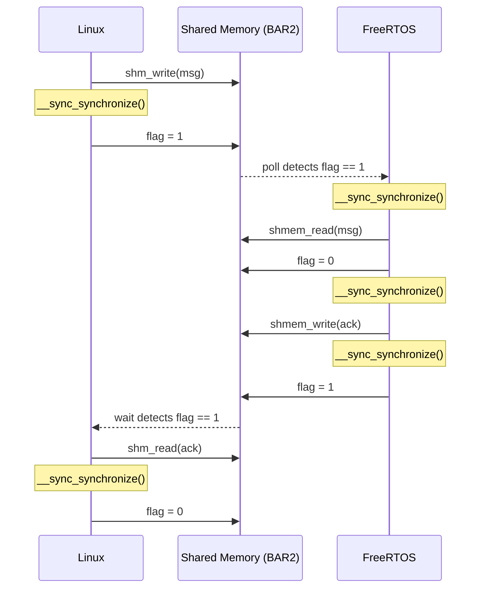

# Chimera — Heterogeneous SoC Demo

A QEMU-based demo of a heterogeneous SoC: an ARM-Linux guest and a RISCV-Linux guest each exchange timestamped HELLO/ACK messages with a bare-metal RISCV FreeRTOS firmware over two independent ivshmem (inter-VM shared memory) channels.

---

## Architecture

```
 ┌─────────────────────────┐      ivshmem-arm-freertos      ┌──────────────────────────────────┐
 │  ARM-Linux (aarch64)    │ ◄────────────────────────────► │                                  │
 │  Alpine Linux            │  /tmp/ivshmem-arm-freertos/    │  RISCV FreeRTOS (bare-metal)     │
 │  QEMU virt (gic-version=3)│  IVSHMEM0_SHMEM=0x31000000   │  QEMU chimera-riscv-freertos-demo│
 └─────────────────────────┘                                 │                                  │
                                                             │  Polls both channels every 1 ms  │
 ┌─────────────────────────┐      ivshmem-riscv-freertos    │  Sends ACK with FreeRTOS tick    │
 │  RISCV-Linux (rv64)     │ ◄────────────────────────────► │  timestamp                       │
 │  Alpine Linux            │  /tmp/ivshmem-riscv-freertos/  │                                  │
 │  QEMU virt (OpenSBI)    │  IVSHMEM1_SHMEM=0x36000000    └──────────────────────────────────┘
 └─────────────────────────┘
```

### Components

| Component | Machine | OS | Role |
|---|---|---|---|
| ARM-Linux | QEMU `virt` aarch64, Cortex-A57 | Alpine Linux | Sends HELLO, waits for ACK |
| RISCV-Linux | QEMU `virt` rv64, OpenSBI | Alpine Linux | Sends HELLO, waits for ACK |
| RISCV FreeRTOS | QEMU `chimera-riscv-freertos-demo` | Bare-metal FreeRTOS | Receives HELLO, sends ACK |
| ivshmem-server (ARM) | Host process | — | Brokers shared memory for ARM↔FreeRTOS |
| ivshmem-server (RISCV) | Host process | — | Brokers shared memory for RISCV↔FreeRTOS |

### ivshmem Device Types

- **Linux guests** use `ivshmem-doorbell` (PCI device, BAR2 = 64 MiB shared memory window)
- **FreeRTOS** uses `ivshmem-flat` (custom sysbus device, memory-mapped at fixed addresses)

The custom QEMU machine (`hw/riscv/chimera_freertos_demo.c`) connects FreeRTOS to both ivshmem servers simultaneously:

| Link | MMIO base | SHMEM base |
|---|---|---|
| ARM ↔ FreeRTOS | `0x30000000` | `0x31000000` |
| RISCV ↔ FreeRTOS | `0x35000000` | `0x36000000` |

---

## Wire Protocol

Defined in `contrib/heterogeneous-soc/freertos-showcase/hello_proto.h`.

### Message layout (`struct hsoc_hello_msg`, 96 bytes)

| Field | Type | Description |
|---|---|---|
| `magic` | `uint32_t` | `0x48454c4f` ("HELO") |
| `version` | `uint16_t` | Protocol version (1) |
| `msg_type` | `uint16_t` | `HSOC_MSG_HELLO` (1) or `HSOC_MSG_ACK` (2) |
| `seq` | `uint32_t` | Sequence number |
| `sender_id` | `uint32_t` | `ARM_LINUX`=1, `RISCV_LINUX`=2, `RISCV_FREERTOS`=3 |
| `ts_sec` | `int64_t` | Send timestamp — seconds |
| `ts_nsec` | `int64_t` | Send timestamp — nanoseconds |
| `text` | `char[64]` | Human-readable label |

### Shared memory layout (`struct hsoc_layout`)

```
Offset 0x0000  struct hsoc_channel  linux_to_freertos   (flag + msg)
               ... pad to 0x1000 ...
Offset 0x1000  struct hsoc_channel  freertos_to_linux   (flag + msg)
```

Each `hsoc_channel` holds a `volatile uint32_t flag` (0 = empty, 1 = ready) followed by an `hsoc_hello_msg`.

### Handshake sequence



---

## Tmux Pane Layout

Running `scripts/heterogeneous-soc/run-phase5-tmux.sh` opens a single tmux window with five panes:

```
┌──────────────────────────────┬──────────────────────────────┐
│  ivshmem-server              │  ivshmem-server              │
│  (ARM ↔ FreeRTOS)           │  (RISCV ↔ FreeRTOS)         │
│  pane 0                      │  pane 1                      │
├──────────────────────────────┴──────────────────────────────┤
│                                                              │
│  RISCV FreeRTOS                                             │
│  (receives HELLO from both Linux guests, sends ACK)         │
│  pane 2                                                      │
├──────────────────────────────┬──────────────────────────────┤
│  ARM-Linux                   │  RISCV-Linux                 │
│  hello-arm-linux             │  hello-riscv-linux           │
│  pane 3                      │  pane 4                      │
└──────────────────────────────┴──────────────────────────────┘
```

Navigate with **Ctrl-b** + arrow keys. Both Linux panes auto-login as `root`, mount the 9p virtfs share, and launch the hello binary once the guest boots.

---

## Running the Demo

```bash
scripts/heterogeneous-soc/run-phase5-tmux.sh
```

On first run, the script performs one-time setup (Lima guest installation, Alpine disk images, ivshmem-server binary). On every run it rebuilds the FreeRTOS ELF and Linux hello binaries from source before launching the tmux session.

### Prerequisites

- macOS host with [Lima](https://lima-vm.io/) (`brew install lima`)
- QEMU built from this tree (or installed system QEMU)
- Alpine Linux ISOs for aarch64 and riscv64 (fetched automatically by `fetch-images.sh`)

Cross-compilation happens inside the Lima VM (`qemu-dev`), which provides:

| Cross-compiler | Target |
|---|---|
| `aarch64-linux-gnu-gcc` | ARM-Linux hello binary |
| `riscv64-linux-gnu-gcc` | RISCV-Linux hello binary |
| `riscv64-unknown-elf-gcc` | FreeRTOS bare-metal ELF |

### Source layout

```
contrib/heterogeneous-soc/freertos-showcase/
  hello_proto.h           — shared wire protocol definitions
  linux_hello.c           — Linux sender (ARM and RISCV, compiled separately)
  freertos_main.c         — FreeRTOS task entry point
  freertos_ivshmem_flat.c — ivshmem poll/send helpers (volatile byte access)
  freertos_ivshmem_flat.h
  Makefile

scripts/heterogeneous-soc/
  run-phase5-tmux.sh                    — main launcher
  build-freertos-showcase.sh            — builds all three binaries via Lima
  start-ivshmem-server-arm-freertos.sh  — starts ARM ivshmem-server
  start-ivshmem-server-riscv-freertos.sh — starts RISCV ivshmem-server
  run-arm-phase5.sh                     — launches ARM-Linux QEMU
  run-riscv-phase5.sh                   — launches RISCV-Linux QEMU
  run-riscv-freertos-phase5.sh          — launches FreeRTOS QEMU

hw/riscv/chimera_freertos_demo.c  — custom QEMU machine
hw/misc/ivshmem-flat.c            — custom ivshmem sysbus device
```

---

## Implementation Notes

### Volatile byte helpers

All copies to/from ivshmem use explicit volatile byte loops instead of `memcpy`/struct assignment:

- **ARM-Linux**: ARM `printf`/`memcpy` use NEON instructions, which SIGBUS on non-cacheable PCI BAR2 memory. The `shm_write`/`shm_read` helpers in `linux_hello.c` avoid this.
- **FreeRTOS**: GCC `-O2` loop-invariant code motion (LICM) hoists non-volatile struct reads out of the poll loop, returning stale zeros on every iteration. The `shmem_read`/`shmem_write` helpers in `freertos_ivshmem_flat.c` prevent this.

### Memory barriers

`__sync_synchronize()` is placed around every flag write and read:
- RISCV: emits `fence iorw,iorw`
- AArch64: emits `dmb ish`

This ensures message body writes are globally visible before the flag is set, and that the flag read completes before the message body is read.
