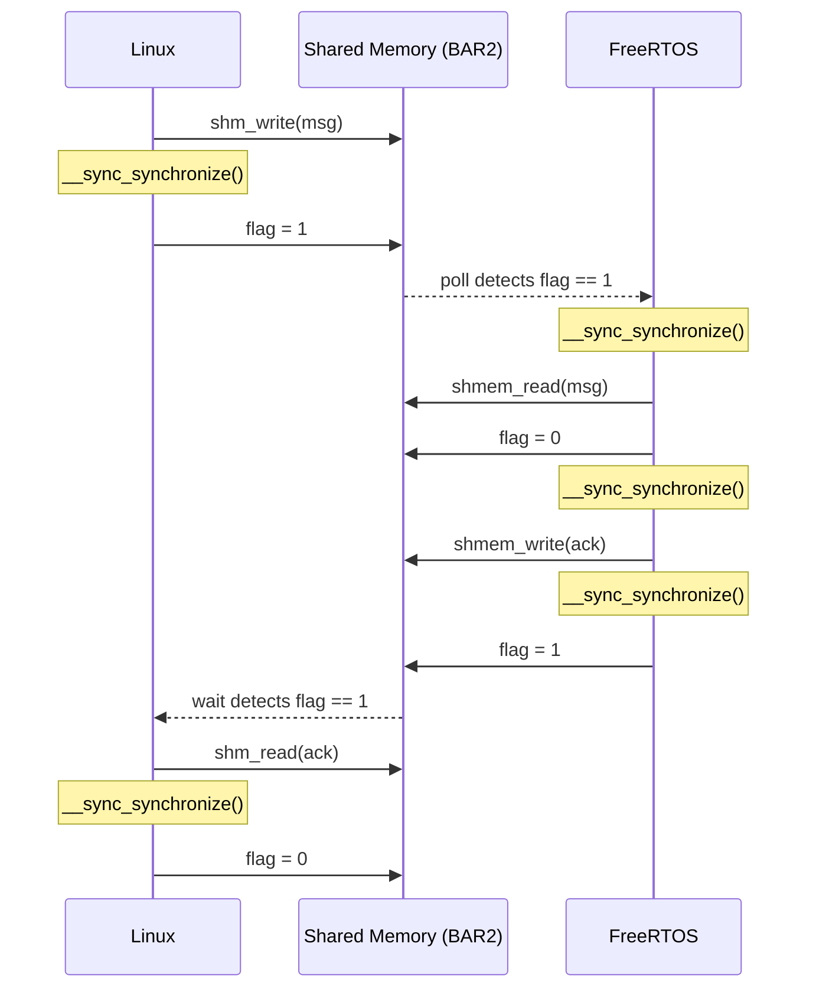

# Chimera — Heterogeneous SoC Demo

A QEMU-based demo of a heterogeneous SoC: ARM-Linux, RISCV-Linux, and MIPS-Linux guests each exchange timestamped HELLO/ACK messages with a bare-metal RISCV FreeRTOS firmware over three independent ivshmem (inter-VM shared memory) channels.

---

## Architecture

```
 ┌─────────────────────────┐      ivshmem-arm-freertos      ┌──────────────────────────────────┐
 │  ARM-Linux (aarch64)    │ ◄────────────────────────────► │                                  │
 │  Debian Linux           │  /tmp/ivshmem-arm-freertos/    │  RISCV FreeRTOS (bare-metal)     │
 │  QEMU virt (gic-ver.=3) │  IVSHMEM0_SHMEM=0x31000000     │  QEMU chimera-riscv-freertos-demo│
 └─────────────────────────┘                                │                                  │
                                                            │  Polls all three channels every  │
 ┌─────────────────────────┐      ivshmem-riscv-freertos    │  1 ms; sends ACK with FreeRTOS   │
 │  RISCV-Linux (rv64)     │ ◄────────────────────────────► │  tick timestamp                  │
 │  Debian Linux           │  /tmp/ivshmem-riscv-freertos/  │                                  │
 │  QEMU virt (OpenSBI)    │  IVSHMEM1_SHMEM=0x36000000     │                                  │
 └─────────────────────────┘                                │                                  │
                                                            │                                  │
 ┌─────────────────────────┐      ivshmem-mips-freertos     │                                  │
 │  MIPS-Linux (mips32)    │ ◄────────────────────────────► │                                  │
 │  Debian Linux 12        │  /tmp/ivshmem-mips-freertos/   │                                  │
 │  QEMU malta             │  IVSHMEM2_SHMEM=0x3B000000     └──────────────────────────────────┘
 └─────────────────────────┘
```

### Components

| Component | Machine | OS | Role |
|---|---|---|---|
| ARM-Linux | QEMU `virt` aarch64, Cortex-A57 | Debian Linux 12 (bookworm) | Sends HELLO, waits for ACK |
| RISCV-Linux | QEMU `virt` rv64, OpenSBI | Debian Linux 12 (bookworm) | Sends HELLO, waits for ACK |
| MIPS-Linux | QEMU `malta` mips32 | Debian Linux 12 (bookworm) | Sends HELLO, waits for ACK |
| RISCV FreeRTOS | QEMU `chimera-riscv-freertos-demo` | Bare-metal FreeRTOS | Receives HELLO from all three, sends ACK |
| ivshmem-server (ARM) | Host process | — | Brokers shared memory for ARM↔FreeRTOS |
| ivshmem-server (RISCV) | Host process | — | Brokers shared memory for RISCV↔FreeRTOS |
| ivshmem-server (MIPS) | Host process | — | Brokers shared memory for MIPS↔FreeRTOS |

### ivshmem Device Types

- **Linux guests** use `ivshmem-doorbell` (PCI device, BAR2 = 64 MiB shared memory window)
- **FreeRTOS** uses `ivshmem-flat` (custom sysbus device, memory-mapped at fixed addresses)

The custom QEMU machine (`hw/riscv/chimera_freertos_demo.c`) connects FreeRTOS to all three ivshmem servers simultaneously:

| Link | MMIO base | SHMEM base |
|---|---|---|
| ARM ↔ FreeRTOS | `0x30000000` | `0x31000000` |
| RISCV ↔ FreeRTOS | `0x35000000` | `0x36000000` |
| MIPS ↔ FreeRTOS | `0x3A000000` | `0x3B000000` |

---

## Wire Protocol

Defined in `contrib/heterogeneous-soc/freertos-showcase/hello_proto.h`.

### Message layout (`struct hsoc_hello_msg`, 96 bytes)

| Field | Type | Description |
|---|---|---|
| `magic` | `uint32_t` | `0x48454c4f` ("HELO") |
| `version` | `uint16_t` | Protocol version (1) |
| `msg_type` | `uint16_t` | `HSOC_MSG_HELLO` (1) or `HSOC_MSG_ACK` (2) |
| `seq` | `uint32_t` | Sequence number |
| `sender_id` | `uint32_t` | `ARM_LINUX`=1, `RISCV_LINUX`=2, `RISCV_FREERTOS`=3, `MIPS_LINUX`=4 |
| `ts_sec` | `int64_t` | Send timestamp — seconds |
| `ts_nsec` | `int64_t` | Send timestamp — nanoseconds |
| `text` | `char[64]` | Human-readable label |

### Shared memory layout (`struct hsoc_layout`)

```
Offset 0x0000  struct hsoc_channel  linux_to_freertos   (flag + msg)
               ... pad to 0x1000 ...
Offset 0x1000  struct hsoc_channel  freertos_to_linux   (flag + msg)
```

Each `hsoc_channel` holds a `volatile uint32_t flag` (0 = empty, 1 = ready) followed by an `hsoc_hello_msg`.

### Handshake sequence



---

## Tmux Pane Layout

```
┌──────────────────────┬──────────────────────┬──────────────────────┐
│  ivshmem-server      │  ivshmem-server      │  ivshmem-server      │
│  (ARM ↔ FreeRTOS)    │  (RISCV ↔ FreeRTOS)  │  (MIPS ↔ FreeRTOS)   │
│  pane 0              │  pane 1              │  pane 2              │
├──────────────────────┴──────────────────────┴──────────────────────┤
│                                                                    │
│  RISCV FreeRTOS                                                    │
│  (receives HELLO from all three Linux guests, sends ACK)           │
│  pane 3                                                            │
├──────────────────────┬──────────────────────┬──────────────────────┤
│  ARM-Linux           │  RISCV-Linux         │  MIPS-Linux          │
│  hello-arm-linux     │  hello-riscv-linux   │  hello-mips-linux    │
│  pane 4              │  pane 5              │  pane 6              │
└──────────────────────┴──────────────────────┴──────────────────────┘
```

Navigate with **Ctrl-b** + arrow keys. All Linux panes auto-login as `root`, mount the 9p virtfs share, and launch the hello binary once the guest boots.

---

## Running the Demo

### Quick start (two commands from macOS host)

**Step 1 — Deploy source tree and create the Lima VM** (run once on the macOS host):

```bash
bash scripts/heterogeneous-soc/host-install-lima-host.sh
```

This creates the `qemu-dev` Lima VM (if it does not already exist) and rsyncs the `chimera-src` tree into `~/chimera-src` inside the VM.

**Step 2 — Launch the full showcase** (run inside Lima, or via `limactl shell`):

```bash
limactl shell qemu-dev -- bash ~/chimera-src/scripts/heterogeneous-soc/guest-run-chimera-showcase.sh
```

Re-run Step 1 after pulling new commits to redeploy the source tree before Step 2.

---

`guest-run-chimera-showcase.sh` is the full-stack launcher. It runs 8 stages, each idempotent:

| Stage | What it does | Skip condition |
|---|---|---|
| 1 — apt packages | Installs all build deps including `gcc-mips-linux-gnu` | Already installed |
| 2 — kernel packages | Downloads ARM / RISCV / MIPS Debian kernel .deb packages | File already exists |
| 3 — QEMU build | Builds `qemu-system-aarch64/riscv64/mipsel` + `ivshmem-server` | All binaries already in `BUILD_DIR` |
| 4 — FreeRTOS kernel | Clones / pulls FreeRTOS-Kernel | Already cloned (pulls latest) |
| 5 — Showcase binaries | Builds ELF + `hello-{arm,riscv,mips}-linux` | Warns if MIPS binary absent |
| 6 — Debian rootfs | Creates minimal Debian qcow2 disks via debootstrap | Skipped if disk exists |
| 7 — boot assets | Extracts kernel + initramfs from Debian kernel .deb packages | Skipped if already extracted |
| 8 — Launch | Opens 7-pane tmux session | — |

**Environment overrides:**

| Variable | Effect |
|---|---|
| `SKIP_PREREQS=1` | Skip stages 1–2 (fast re-run after first setup) |
| `SKIP_BUILD=1` | Skip stages 1–7 (jump straight to tmux launch using cached binaries) |
| `BUILD_DIR` | QEMU build output directory (default: `~/chimera-build-linux`) |
| `ASSET_DIR` | Kernel .deb / disk image cache directory (default: `~/iso`) |

### Manual step-by-step

```bash
# One-time: set up Lima VM (macOS host)
scripts/heterogeneous-soc/host-install-lima-host.sh

# Inside Lima:
limactl shell qemu-dev

# Install build dependencies (once)
bash ~/chimera-src/scripts/heterogeneous-soc/guest-install-lima-guest.sh

# Fetch Debian kernel packages
bash ~/chimera-src/scripts/heterogeneous-soc/guest-fetch-images.sh

# Build QEMU + ivshmem-server
BUILD_DIR=$HOME/chimera-build-linux VM_SOURCE_DIR=$HOME/chimera-src \
    bash ~/chimera-src/scripts/heterogeneous-soc/guest-build-ivshmem-tools.sh

# Fetch FreeRTOS kernel source
bash ~/chimera-src/scripts/heterogeneous-soc/guest-fetch-freertos-kernel.sh

# Build FreeRTOS showcase binaries
bash ~/chimera-src/scripts/heterogeneous-soc/guest-build-freertos-showcase.sh

# Launch the showcase
CHIMERA_ROOT=~/chimera-src BUILD_DIR=~/chimera-build-linux \
    bash ~/chimera-src/scripts/heterogeneous-soc/guest-run-phase5-tmux.sh
```

### Prerequisites

- macOS host with [Lima](https://lima-vm.io/) (`brew install lima`)
- QEMU built from this tree inside the Lima VM (`qemu-dev`)
- Debian kernel .deb packages for arm64, riscv64, and mips (fetched automatically)

Cross-compilation happens inside the Lima VM, which provides:

| Cross-compiler | Target |
|---|---|
| `aarch64-linux-gnu-gcc` | ARM-Linux hello binary |
| `riscv64-linux-gnu-gcc` | RISCV-Linux hello binary |
| `mips-linux-gnu-gcc` | MIPS-Linux hello binary |
| `riscv64-unknown-elf-gcc` | FreeRTOS bare-metal ELF |

> **MIPS OS note:** Debian dropped big-endian 32-bit MIPS (mips) after Debian 8 (jessie). The demo uses the `4kc-malta` kernel from the Debian 12 `debian-ports` archive. The MIPS rootfs is built via `debootstrap` using the `debian-ports` suite.

---

## Source Layout

```
contrib/heterogeneous-soc/
  ivshmem_proto.h             — pingpong wire protocol (ARM↔RISCV, used by ping/pong demo)
  ping.c                      — ARM-side ivshmem sender (pingpong demo)
  pong.c                      — RISCV-side ivshmem responder (pingpong demo)
  ping.sh / pong.sh           — wrapper scripts that run the ping/pong binaries
  Makefile                    — cross-compiles ping + pong (static, ARM + RISCV)
  freertos-showcase/
    hello_proto.h             — shared wire protocol (sender IDs, message structs)
    linux_hello.c             — Linux sender (ARM, RISCV, and MIPS, compiled separately)
    freertos_main.c           — FreeRTOS task: polls all three channels, sends ACK
    freertos_ivshmem_flat.c   — ivshmem poll/send helpers (volatile byte access)
    freertos_ivshmem_flat.h
    Makefile

scripts/heterogeneous-soc/
  ── Main showcase launchers ──────────────────────────────────────────────────
  guest-run-chimera-showcase.sh               — full-stack launcher (prereqs + build + tmux)
  guest-run-phase5-tmux.sh                    — 7-pane tmux session launcher (called by showcase)

  ── CI / headless harnesses ──────────────────────────────────────────────────
  guest-run-debian-harness.sh                 — headless pass/fail CI harness (all 3 guests)
  guest-run-freertos-harness.sh               — headless FreeRTOS harness (ARM-only pass string)

  ── Build scripts ────────────────────────────────────────────────────────────
  guest-build-freertos-showcase.sh            — builds FreeRTOS ELF + hello-{arm,riscv,mips}-linux
  guest-build-ivshmem-tools.sh                — builds QEMU + ivshmem-server inside Lima
  guest-build-pingpong.sh                     — builds ping/pong binaries (ARM↔RISCV demo)
  guest-build-arm-secure-stack.sh             — builds TF-A + Hafnium + OP-TEE secure stack

  ── Fetch / setup ────────────────────────────────────────────────────────────
  guest-fetch-images.sh                       — downloads Debian kernel .deb packages
  guest-fetch-freertos-kernel.sh              — clones/pulls FreeRTOS-Kernel source
  guest-fetch-arm-secure-stack.sh             — fetches TF-A, Hafnium, and OP-TEE sources
  guest-install-lima-guest.sh                 — installs apt packages in Lima VM
  host-install-lima-host.sh                   — creates the Lima VM (run on macOS host)

  ── Rootfs / boot-asset preparation ─────────────────────────────────────────
  guest-prepare-debian-rootfs.sh              — creates minimal Debian qcow2 disks (debootstrap)
  guest-prepare-debian-boot-assets.sh         — extracts kernel + initrd from .deb packages

  ── ivshmem-server wrappers ──────────────────────────────────────────────────
  guest-start-ivshmem-server.sh               — generic single-channel ivshmem-server wrapper
  guest-start-ivshmem-server-arm-freertos.sh  — ARM ivshmem-server (showcase channel)
  guest-start-ivshmem-server-riscv-freertos.sh — RISCV ivshmem-server (showcase channel)
  guest-start-ivshmem-server-mips-freertos.sh — MIPS ivshmem-server (showcase channel)

  ── QEMU guest launchers ─────────────────────────────────────────────────────
  guest-run-riscv-freertos-phase5.sh          — launches FreeRTOS QEMU
  guest-run-arm-phase5.sh                     — launches ARM-Linux QEMU (Debian)
  guest-run-riscv-phase5.sh                   — launches RISCV-Linux QEMU (Debian)
  guest-run-chimera.sh                        — launches MIPS-Linux QEMU (Malta machine)

  ── In-guest binary helpers ──────────────────────────────────────────────────
  guest-run-hello-arm.sh                      — runs hello-arm-linux inside the ARM guest
  guest-run-hello-riscv.sh                    — runs hello-riscv-linux inside the RISCV guest
  guest-run-ping.sh                           — runs ping binary inside the ARM guest
  guest-run-pong.sh                           — runs pong binary inside the RISCV guest
  guest-copy-pingpong.sh                      — SCP ping/pong binaries to guests over SSH

  ── Demo automation helpers ──────────────────────────────────────────────────
  guest-demo-auto-prepare-guests.sh           — polls for boot, auto-logins, mounts 9p share
  guest-demo-prepare-guests.sh                — login root + mount pingpong 9p share
  guest-demo-login-root.sh                    — send "root" to ARM and RISCV tmux panes
  guest-demo-mount-pingpong.sh                — mount pingpong virtfs share in both guests
  guest-demo-send-to-pane.sh                  — utility: send a command to a named tmux pane
  guest-demo-run-ping.sh                      — send ping command to ARM pane
  guest-demo-run-pong.sh                      — send pong command to RISCV pane
  guest-stop-demo-guests.sh                   — kill QEMU processes from the demo session

  ── Host launchers ───────────────────────────────────────────────────────────
  host-ghostty-demo.sh                        — ARM+RISCV pingpong demo (4-pane tmux, macOS host)

  ── Utilities ────────────────────────────────────────────────────────────────
  common.sh                                   — shared variables and helper functions
  find_ivshmem_bar2.py                        — locates the ivshmem PCI BAR2 sysfs path

  ── Deprecated stubs (backward-compat only) ──────────────────────────────────
  guest-prepare-mips-boot-assets.sh           — replaced by guest-prepare-debian-boot-assets.sh
  guest-prepare-riscv-uboot.sh                — replaced by direct OpenSBI boot

hw/riscv/chimera_freertos_demo.c  — custom QEMU machine (3 ivshmem channels)
hw/misc/ivshmem-flat.c            — custom ivshmem sysbus device (used by FreeRTOS)
```

---

## CI / Headless Testing

Two harness scripts run the demo end-to-end without an interactive terminal and exit `0` (PASS) or `1` (FAIL):

| Script | Pass condition | Timeout |
|---|---|---|
| `guest-run-debian-harness.sh` | FreeRTOS UART contains all three "received hello from …" strings | 600 s |
| `guest-run-freertos-harness.sh` | FreeRTOS UART contains "received hello from arm-linux" | 300 s |

Run inside the Lima VM:

```bash
# Full three-guest harness (recommended for CI):
limactl shell qemu-dev -- bash ~/chimera-src/scripts/heterogeneous-soc/guest-run-debian-harness.sh

# Quick single-sender variant:
limactl shell qemu-dev -- bash ~/chimera-src/scripts/heterogeneous-soc/guest-run-freertos-harness.sh
```

Both scripts accept the same environment overrides as `guest-run-chimera-showcase.sh` (`SKIP_PREREQS`, `SKIP_BUILD`, etc.) and additionally `HARNESS_TIMEOUT` and `HARNESS_LOG_DIR` (default `/tmp/debian-harness-logs`). On failure, per-pane log files are written to `HARNESS_LOG_DIR` for post-mortem.

---

## Pingpong Demo (ARM ↔ RISCV, no FreeRTOS)

The earlier two-guest demo (`ping.c` / `pong.c`) is still present in `contrib/heterogeneous-soc/`. It uses a simpler protocol (`ivshmem_proto.h`) over a single ivshmem channel and does not involve FreeRTOS.

```bash
# Launch from the macOS host (opens a 4-pane tmux: server | ARM | RISCV | control)
bash scripts/heterogeneous-soc/host-ghostty-demo.sh
```

The control pane prints helper commands for logging in, mounting the 9p share, and starting ping/pong:

```bash
bash scripts/heterogeneous-soc/guest-demo-prepare-guests.sh   # login + mount
bash scripts/heterogeneous-soc/guest-demo-run-pong.sh         # start RISCV pong
bash scripts/heterogeneous-soc/guest-demo-run-ping.sh         # start ARM ping
```

`guest-demo-auto-prepare-guests.sh` handles all of the above automatically — it polls for the boot prompt, logs in as root, and mounts the 9p virtfs share without manual intervention.

---

## Implementation Notes

### Volatile byte helpers

All copies to/from ivshmem use explicit volatile byte loops instead of `memcpy`/struct assignment:

- **ARM-Linux**: ARM `printf`/`memcpy` use NEON instructions, which SIGBUS on non-cacheable PCI BAR2 memory. The `shm_write`/`shm_read` helpers in `linux_hello.c` avoid this.
- **FreeRTOS**: GCC `-O2` loop-invariant code motion (LICM) hoists non-volatile struct reads out of the poll loop, returning stale zeros on every iteration. The `shmem_read`/`shmem_write` helpers in `freertos_ivshmem_flat.c` prevent this.

### Memory barriers

`__sync_synchronize()` is placed around every flag write and read:
- RISCV: emits `fence iorw,iorw`
- AArch64: emits `dmb ish`

This ensures message body writes are globally visible before the flag is set, and that the flag read completes before the message body is read.
