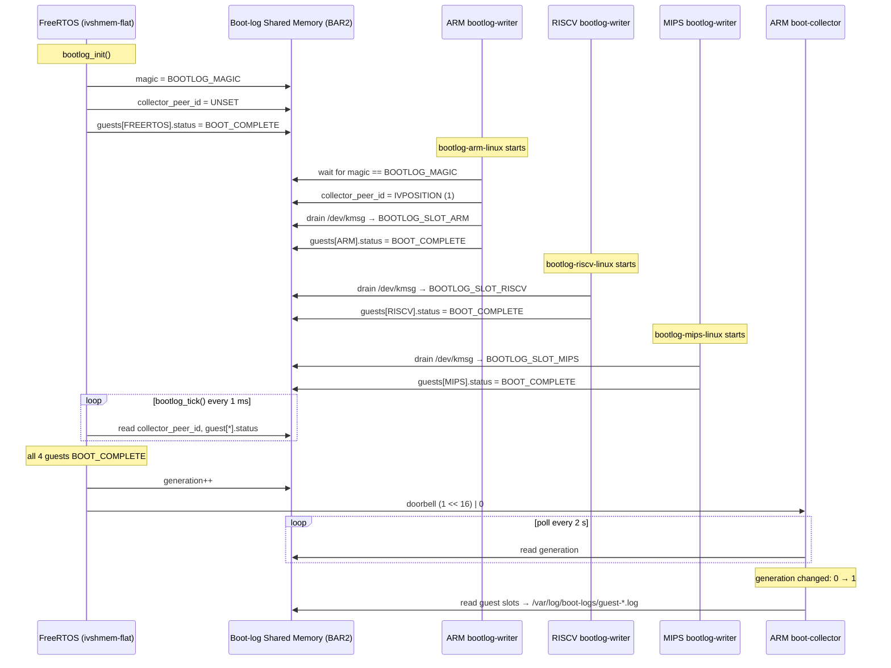
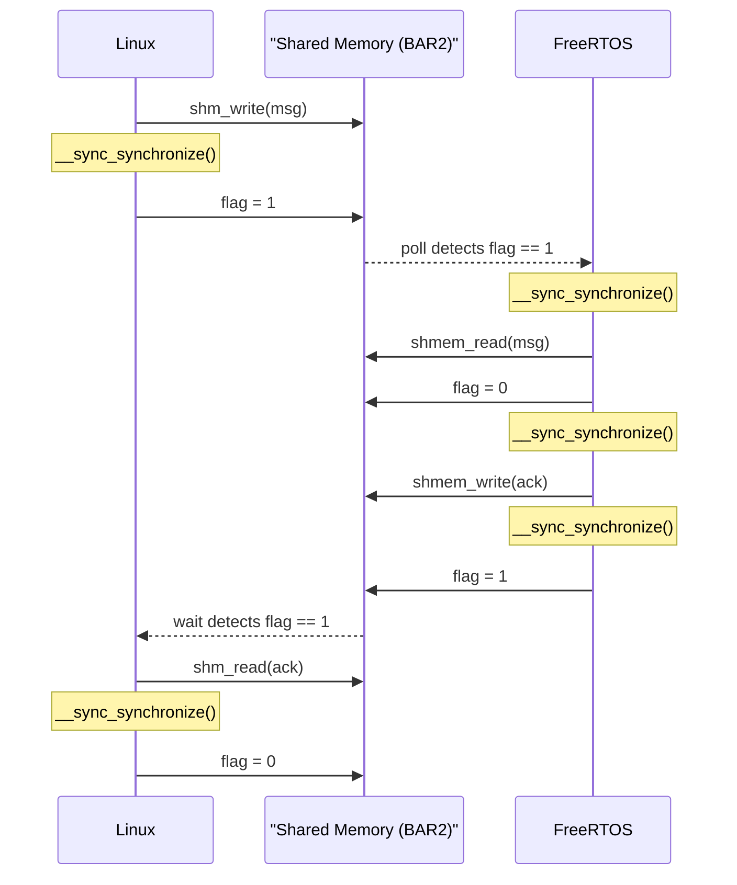
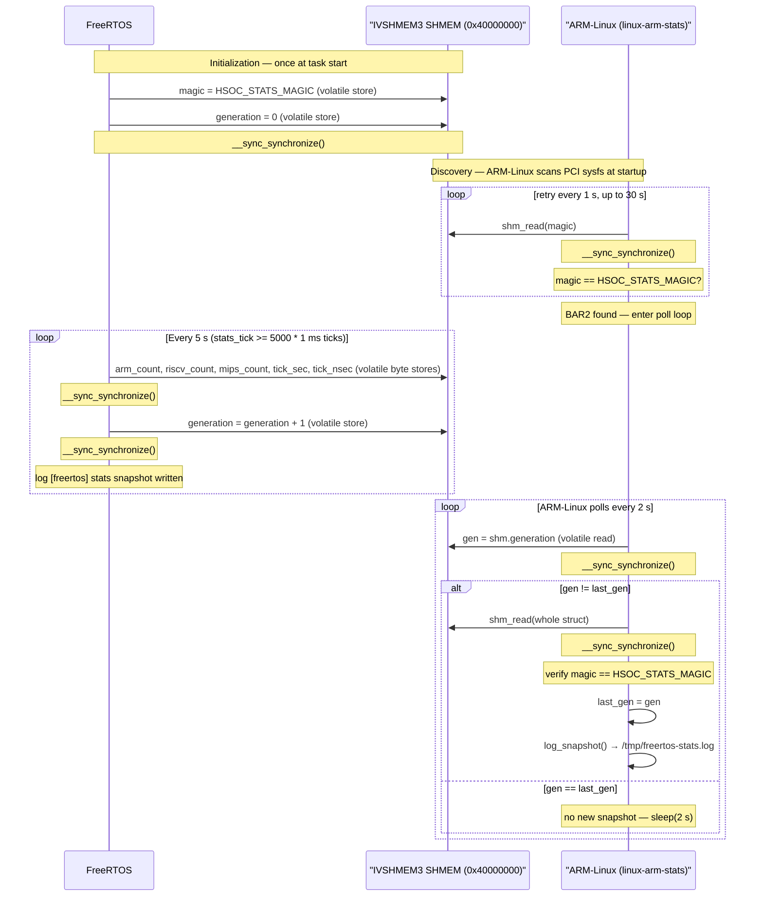

# Chimera — Heterogeneous SoC Demo

A QEMU-based demo of a heterogeneous SoC: ARM-Linux, RISCV-Linux, and MIPS-Linux guests each run a sysinfo logging daemon that sends periodic system snapshots (CPU load, free memory, uptime) to a bare-metal RISCV FreeRTOS firmware over three independent ivshmem (inter-VM shared memory) channels using a HELLO/ACK wire protocol. A fourth ivshmem stats channel carries periodic per-channel message-count snapshots from FreeRTOS to ARM-Linux (logged to `/tmp/freertos-stats.log`), and a fifth boot-log channel collects kernel boot logs from all guests into `/var/log/boot-logs/` on ARM-Linux.

---

## Chimera-Specific Code

All custom code lives in a small surface area on top of upstream QEMU:

| File | Purpose |
|---|---|
| `hw/riscv/chimera_freertos_demo.c` | Custom `chimera-riscv-freertos-demo` QEMU machine: one RV64 hart, CLINT, PLIC, UART, five `ivshmem-flat` devices (3 HELLO/ACK + 1 stats + 1 boot-log) |
| `include/hw/riscv/chimera_freertos_demo.h` | Machine state, memory map enum, IRQ numbers |
| `hw/misc/ivshmem-flat.c` | `ivshmem-flat` sysbus device — memory-mapped ivshmem without PCI, connects to ivshmem-server via Unix socket |
| `include/hw/misc/ivshmem-flat.h` | Device state and interface |
| `contrib/heterogeneous-soc/freertos-showcase/` | FreeRTOS ELF and Linux syslog daemon binaries (wire protocol, build system) |
| `scripts/heterogeneous-soc/` | All launch, build, and setup scripts |

The `ivshmem-flat` device is a sysbus alternative to the PCI `ivshmem-doorbell`; FreeRTOS uses it because bare-metal targets lack a PCI bus. Linux guests use the standard PCI `ivshmem-doorbell`.

`CONFIG_CHIMERA_FREERTOS_DEMO` (`hw/riscv/Kconfig`) selects `CONFIG_IVSHMEM_FLAT_DEVICE` (`hw/misc/Kconfig`) automatically. Both are `default y` for their respective targets.

---

## Architecture

```
 ┌─────────────────────────┐      ivshmem-arm-freertos      ┌──────────────────────────────────┐
 │  ARM-Linux (aarch64)    │ ◄────────────────────────────► │                                  │
 │  Debian Linux           │  /tmp/ivshmem-arm-freertos/    │  RISCV FreeRTOS (bare-metal)     │
 │  QEMU virt (gic-ver.=3) │  IVSHMEM0_SHMEM=0x31000000     │  QEMU chimera-riscv-freertos-demo│
 │                         │◄── ivshmem-stats-freertos ────  │                                  │
 │  linux-arm-stats →      │  /tmp/ivshmem-stats-freertos/  │  Polls all three channels every  │
 │  /tmp/freertos-stats.log│  IVSHMEM3_SHMEM=0x40000000     │  1 ms; sends ACK with FreeRTOS   │
 └─────────────────────────┘                                │  tick timestamp; writes stats    │
                                                            │  snapshot every 5 s              │
 ┌─────────────────────────┐      ivshmem-riscv-freertos    │                                  │
 │  RISCV-Linux (rv64)     │ ◄────────────────────────────► │                                  │
 │  Debian Linux           │  /tmp/ivshmem-riscv-freertos/  │                                  │
 │  QEMU virt (OpenSBI)    │  IVSHMEM1_SHMEM=0x36000000     │                                  │
 └─────────────────────────┘                                │                                  │
                                                            │                                  │
 ┌─────────────────────────┐      ivshmem-mips-freertos     │                                  │
 │  MIPS-Linux (mips32)    │ ◄────────────────────────────► │                                  │
 │  Debian Linux 12        │  /tmp/ivshmem-mips-freertos/   │                                  │
 │  QEMU malta             │  IVSHMEM2_SHMEM=0x3B000000     └──────────────────────────────────┘
 └─────────────────────────┘
```

### Components

| Component | Machine | CPUs / RAM | OS | IP | Hostname | Role |
|---|---|---|---|---|---|---|
| ARM-Linux | 4 / 512 MB | QEMU `virt` aarch64, `-cpu cortex-a57` | Debian Linux 12 (bookworm) | 172.16.100.10 | `debian-arm64.local` | Runs `syslog-arm-linux` (sysinfo → FreeRTOS), waits for ACK; runs `linux-arm-stats` in background |
| RISCV-Linux | 4 / 512 MB | QEMU `virt` rv64, OpenSBI, `-cpu rv64,h=true,v=true` | Debian Linux 12 (bookworm) | 172.16.100.11 | `debian-riscv64.local` | Runs `syslog-riscv-linux` (sysinfo → FreeRTOS), waits for ACK |
| MIPS-Linux | 1 / 512 MB | QEMU `malta` mipsel, `-cpu 24Kf` | Debian Linux 12 (bookworm) | 172.16.100.12 | `debian-mipsel.local` | Runs `syslog-mips-linux` (sysinfo → FreeRTOS), waits for ACK |
| RISCV FreeRTOS | 1 hart / — | QEMU `chimera-riscv-freertos-demo` (1 RV64 hart, `TYPE_RISCV_CPU_BASE`) | Bare-metal FreeRTOS | — | — | Receives HELLO from all three, sends ACK; pushes stats snapshot every 5 s |
| ivshmem-server (ARM) | — / — | Host process | — | — | — | Brokers shared memory for ARM↔FreeRTOS |
| ivshmem-server (RISCV) | — / — | Host process | — | — | — | Brokers shared memory for RISCV↔FreeRTOS |
| ivshmem-server (MIPS) | — / — | Host process | — | — | — | Brokers shared memory for MIPS↔FreeRTOS |
| ivshmem-server (stats) | — / — | Host process | — | — | — | Brokers shared memory for FreeRTOS→ARM stats channel |
| ivshmem-server (boot-log) | — / — | Host process | — | — | — | Brokers shared memory for guest boot logs → ARM |
| Lima VM (`qemu-dev`) | macOS VZ, aarch64 | 8 / 8 GiB | Ubuntu 24.04 (noble) | localhost | `lima-qemu-dev` | Hosts all QEMU guests, ivshmem servers, and cross-compilation toolchains |

### ivshmem Device Types

- **Linux guests** use `ivshmem-doorbell` (PCI device, BAR2 = 64 MiB shared memory window)
- **FreeRTOS** uses `ivshmem-flat` (custom sysbus device, memory-mapped at fixed addresses)

The custom QEMU machine (`hw/riscv/chimera_freertos_demo.c`) connects FreeRTOS to all five ivshmem servers simultaneously:

| Link | MMIO base | SHMEM base | Vectors | Direction |
|---|---|---|---|---|
| ARM ↔ FreeRTOS | `0x30000000` | `0x31000000` | 4 | bidirectional (HELLO/ACK) |
| RISCV ↔ FreeRTOS | `0x35000000` | `0x36000000` | 4 | bidirectional (HELLO/ACK) |
| MIPS ↔ FreeRTOS | `0x3A000000` | `0x3B000000` | 4 | bidirectional (HELLO/ACK) |
| Stats FreeRTOS→ARM | `0x3F000000` | `0x40000000` | 4 | FreeRTOS write only (stats snapshot) |
| Boot-log (all guests → ARM) | `0x44000000` | `0x45000000` | 1 | 3 Linux guests + FreeRTOS → ARM collector (kmsg boot logs) |

**Signaling:** The HELLO/ACK and stats channels use pure shared-memory polling — Linux and FreeRTOS poll `flag`/`generation` fields in shared memory; no doorbell is involved. The 4 vectors on these channels are vestigial.

Only the boot-log channel uses the doorbell mechanism:

| Channel | Who rings | Encoding | Who listens | Actual wakeup |
|---|---|---|---|---|
| Boot-log | FreeRTOS | `(collector_peer_id << 16) \| 0` | (doorbell ignored) | ARM `boot-collector` polls `generation` counter every 2 s |

**Boot-log doorbell flow:**



---

## Wire Protocol

Defined in `contrib/heterogeneous-soc/freertos-showcase/hello_proto.h`.

### Message layout (`struct hsoc_hello_msg`, 96 bytes)

| Field | Type | Description |
|---|---|---|
| `magic` | `uint32_t` | `0x48454c4f` ("HELO") |
| `version` | `uint16_t` | Protocol version (1) |
| `msg_type` | `uint16_t` | `HSOC_MSG_HELLO` (1) or `HSOC_MSG_ACK` (2) |
| `seq` | `uint32_t` | Sequence number |
| `sender_id` | `uint32_t` | `ARM_LINUX`=1, `RISCV_LINUX`=2, `RISCV_FREERTOS`=3, `MIPS_LINUX`=4 |
| `ts_sec` | `int64_t` | Send timestamp — seconds |
| `ts_nsec` | `int64_t` | Send timestamp — nanoseconds |
| `text` | `char[64]` | Human-readable label |

### Shared memory layout (`struct hsoc_layout`)

```
Offset 0x0000  struct hsoc_channel  linux_to_freertos   (flag + msg)
               ... pad to 0x1000 ...
Offset 0x1000  struct hsoc_channel  freertos_to_linux   (flag + msg)
```

Each `hsoc_channel` holds a `volatile uint32_t flag` (0 = empty, 1 = ready) followed by an `hsoc_hello_msg`.

### Handshake sequence



### Stats snapshot (`struct hsoc_stats_snapshot`, `stats_proto.h`)

FreeRTOS writes a stats snapshot into IVSHMEM3 every 5 seconds (5000 1-ms ticks). ARM-Linux runs `linux-arm-stats` which polls the corresponding PCI BAR2 every 2 seconds and appends new snapshots to `/tmp/freertos-stats.log`.

| Field | Type | Description |
|---|---|---|
| `magic` | `uint32_t` | `0x53544154` ("STAT") — identifies this BAR2 |
| `generation` | `volatile uint32_t` | Monotonically incremented by FreeRTOS on each snapshot |
| `arm_count` | `uint32_t` | Total HELLO messages received from ARM-Linux |
| `riscv_count` | `uint32_t` | Total HELLO messages received from RISCV-Linux |
| `mips_count` | `uint32_t` | Total HELLO messages received from MIPS-Linux |
| `tick_sec` | `int64_t` | FreeRTOS tick time of this snapshot — seconds |
| `tick_nsec` | `int64_t` | FreeRTOS tick time — nanoseconds |

ARM-Linux detects a new snapshot when `generation` changes. It scans all PCI ivshmem devices (`vendor 0x1af4`) and identifies the stats BAR2 by the `STAT` magic value.

Example log output:
```
[2026-06-06T12:34:56Z] gen=1 arm=0 riscv=0 mips=0 tick=5.000000000
[2026-06-06T12:34:58Z] gen=2 arm=3 riscv=2 mips=1 tick=10.000000000
```

### Stats periodic sync sequence



---

## Tmux Pane Layout

```
┌────────────┬────────────┬────────────┬────────────┐
│ ivshmem-   │ ivshmem-   │ ivshmem-   │ ivshmem-   │
│ server     │ server     │ server     │ server     │
│ ARM↔FRT    │ RISCV↔FRT  │ MIPS↔FRT   │ stats→ARM  │
│ pane 0     │ pane 1     │ pane 2     │ pane 3     │
├────────────┴────────────┴────────────┴────────────┤
│                                                    │
│  RISCV FreeRTOS                                   │
│  (HELLO/ACK all channels; stats snapshot every 5s)│
│  pane 4                                            │
├────────────────┬────────────────┬─────────────────┤
│  ARM-Linux     │  RISCV-Linux   │  MIPS-Linux     │
│  linux-arm-stats (bg)           │                 │
│  syslog-arm-   │ syslog-riscv-  │ syslog-mips-    │
│  linux         │  linux         │ linux           │
│  pane 5        │  pane 6        │  pane 7         │
└────────────────┴────────────────┴─────────────────┘
```

Navigate with **Ctrl-b** + arrow keys. All Linux panes auto-login as `root`, mount the 9p virtfs share, and launch their daemons once the guest boots. The syslog daemons (`syslog-{arm,riscv,mips}-linux`) are pre-installed into each guest's `/usr/local/bin/` by `guest-install-syslog-to-guests.sh` and run directly from the guest filesystem. In pane 5, `linux-arm-stats` runs in the background before `syslog-arm-linux` starts; stats are appended to `/tmp/freertos-stats.log` inside the ARM guest.

---

## Guest Networking & Avahi Discovery

All three Linux guests share a flat L2 network managed by a Linux bridge inside the Lima VM:

```
Lima host  172.16.100.1
     │
chbr0 (172.16.100.0/24)
     ├── tap-arm   → debian-arm64   (172.16.100.10)
     ├── tap-riscv → debian-riscv64 (172.16.100.11)
     └── tap-mips  → debian-mipsel  (172.16.100.12)
```

The bridge (`chbr0`) and TAP devices are created idempotently by `guest-setup-network-bridge.sh` each time the showcase or tmux launcher starts. mDNS multicast flows across the bridge so Avahi on every node can discover the others.

Each guest runs:
- `avahi-daemon` — advertises hostname, SSH, and the Chimera syslog service
- `sshd` — starts on boot; root login enabled (no password)
- `systemd-networkd` — configures the static IP on `eth0`/`ens*`

### Browsing services from the Lima host

```bash
# List all Avahi services on the network
avahi-browse -at

# Watch for Chimera syslog daemons as they come online
avahi-browse -rt _chimera-syslog._tcp

# Watch for SSH services
avahi-browse -rt _ssh._tcp
```

Example `avahi-browse -at` output once all guests are up:

```
+  chbr0 IPv4 SSH on debian-arm64          _ssh._tcp            local
+  chbr0 IPv4 SSH on debian-riscv64        _ssh._tcp            local
+  chbr0 IPv4 SSH on debian-mipsel         _ssh._tcp            local
+  chbr0 IPv4 Chimera syslog on debian-arm64    _chimera-syslog._tcp  local
+  chbr0 IPv4 Chimera syslog on debian-riscv64  _chimera-syslog._tcp  local
+  chbr0 IPv4 Chimera syslog on debian-mipsel   _chimera-syslog._tcp  local
```

### Resolving `.local` hostnames

```bash
# From Lima host
ping debian-arm64.local
ping debian-riscv64.local
ping debian-mipsel.local
```

### SSH into any guest (no password)
```bash
ssh root@debian-arm64.local
ssh root@debian-riscv64.local
ssh root@debian-mipsel.local
```

### SSH from macOS (ProxyJump through Lima)

The `172.16.100.x` subnet lives inside the Lima VM, so macOS has no direct route to the guests. Use Lima as a jump host.

Lima assigns a **random SSH port** on each VM start. Look it up with `limactl list`:

```bash
limactl list    # SSH column shows 127.0.0.1:<port>
```

You can also use the guest's mDNS hostname (`debian-arm64.local`) instead of the IP — the jump host resolves it via Avahi:

```bash
# One-off (no config needed) — replace <PORT> with the actual port
ssh -i ~/.lima/_config/user -o StrictHostKeyChecking=no \
    -J yhsung@127.0.0.1:<PORT> root@debian-arm64.local    # ARM
ssh -i ~/.lima/_config/user -o StrictHostKeyChecking=no \
    -J yhsung@127.0.0.1:<PORT> root@debian-riscv64.local  # RISCV
ssh -i ~/.lima/_config/user -o StrictHostKeyChecking=no \
    -J yhsung@127.0.0.1:<PORT> root@debian-mipsel.local   # MIPS
```

Or add this to `~/.ssh/config` to use mDNS hostnames with auto-detected port:

```
Host lima-qemu-dev
    HostName 127.0.0.1
    Port 52704
    User yhsung
    IdentityFile ~/.lima/_config/user
    StrictHostKeyChecking no
    UserKnownHostsFile /dev/null

Host debian-arm64
    HostName debian-arm64.local
    User root
    ProxyJump lima-qemu-dev
    StrictHostKeyChecking no
    UserKnownHostsFile /dev/null

Host debian-riscv64
    HostName debian-riscv64.local
    User root
    ProxyJump lima-qemu-dev
    StrictHostKeyChecking no
    UserKnownHostsFile /dev/null

Host debian-mipsel
    HostName debian-mipsel.local
    User root
    ProxyJump lima-qemu-dev
    StrictHostKeyChecking no
    UserKnownHostsFile /dev/null
```

**Note:** The `Port` in `lima-qemu-dev` is a static placeholder — Lima assigns a
random SSH port on each `limactl start`. The `chimera-ssh` function below resolves
it automatically by using Lima's generated `ssh.config`:

```bash
# Source the deployment script to get chimera-ssh in your current shell:
source scripts/heterogeneous-soc/host-install-lima-host.sh

# Or define it manually:
chimera-ssh() {
  local ssh_config="$HOME/.lima/qemu-dev/ssh.config"
  [[ -f "$ssh_config" ]] || { echo "Lima VM not running (no ssh.config)"; return 1; }
  ssh -F "$ssh_config" \
      -o ProxyCommand="ssh -F '$ssh_config' -W %h:%p lima-qemu-dev" \
      -o PasswordAuthentication=no \
      -o StrictHostKeyChecking=no \
      -o UserKnownHostsFile=/dev/null \
      "$@"
}
```

Usage: `chimera-ssh root@debian-arm64.local`

**Key injection:** The showcase script automatically injects your macOS SSH
public key into all guest disk images each time it runs (step 6.8), so
`chimera-ssh` works out of the box. If you need to re-inject keys manually:

```bash
chimera-keyinject   # also defined by sourcing host-install-lima-host.sh
```

> **Note:** The Lima SSH port (52704 above) can change across `limactl stop`/`start` cycles. Check the current value with `limactl list`.

### Cross-guest discovery (from inside a guest)

```bash
# In the ARM guest tmux pane (pane 5)
ping -c1 debian-riscv64.local
avahi-browse -rt _chimera-syslog._tcp
```

### First run after this feature is added

Existing disk images built before Avahi support was added do not contain `avahi-daemon` and will be rejected by the showcase launcher with a clear message. Delete them to trigger a fresh `debootstrap` build:

```bash
rm -f ~/iso/debian-arm64.qcow2 ~/iso/debian-riscv64.qcow2 ~/iso/debian-mips.qcow2
```

Then re-run `guest-run-chimera-showcase.sh` — Stage 6 will rebuild all three images (this takes several minutes).

---

## Running the Demo

### Quick start (2 steps)

**Step 1 — Deploy source tree and create the Lima VM** (run once on the macOS host; re-run after every pull):

```bash
bash scripts/heterogeneous-soc/host-install-lima-host.sh
```

**Step 2 — launch the full showcase** (from the macOS host; re-run any time):

```bash
limactl shell qemu-dev -- bash ~/chimera-src/scripts/heterogeneous-soc/guest-run-chimera-showcase.sh
```

Step 2 handles everything: installing build dependencies, fetching disk images, building QEMU and all firmware binaries, and opening the 8-pane tmux showcase. Every stage is idempotent — re-running is safe and fast after the first run.

### What the showcase launcher does

`guest-run-chimera-showcase.sh` runs 8 stages:

| Stage | What it does | Skip condition |
|---|---|---|
| 0.5 — Network bridge | Creates `chbr0` bridge + `tap-arm/riscv/mips` TAP devices via `guest-setup-network-bridge.sh` | Idempotent — runs every launch |
| 1 — apt packages | Installs all build deps including `gcc-mipsel-linux-gnu`, `qemu-utils` | Already installed |
| 2 — kernel packages | Downloads ARM / RISCV / MIPS Debian kernel .deb packages | File already exists |
| 3 — QEMU build | Builds `qemu-system-aarch64/riscv64/mipsel` + `ivshmem-server` | All binaries already in `BUILD_DIR` |
| 4 — FreeRTOS kernel | Clones / pulls FreeRTOS-Kernel | Already cloned (pulls latest) |
| 5 — Showcase binaries | Builds ELF + `syslog-{arm,riscv,mips}-linux` + `linux-arm-stats` | Warns if MIPS binary absent |
| 6 — Debian rootfs | Creates minimal Debian qcow2 disks via debootstrap (includes `avahi-daemon`, `sshd`, static IP) | Skipped if disk exists and contains avahi |
| 6.5 — Inject daemons | Installs `syslog-*-linux` into each guest's `/usr/local/bin/` via `qemu-nbd` | Runs on every build |
| 7 — boot assets | Extracts kernel + initramfs from Debian kernel .deb packages | Skipped if already extracted |
| 8 — Launch | Opens 8-pane tmux session (4 ivshmem servers, FreeRTOS, 3 Linux guests) | — |

**Environment overrides:**

| Variable | Effect |
|---|---|
| `SKIP_PREREQS=1` | Skip stages 1–2 (fast re-run after first setup) |
| `SKIP_BUILD=1` | Skip stages 1–7 (jump straight to tmux launch using cached binaries) |
| `BUILD_DIR` | QEMU build output directory (default: `~/chimera-build-linux`) |
| `ASSET_DIR` | Kernel .deb / disk image cache directory (default: `~/iso`) |

### Manual step-by-step

```bash
# One-time: set up Lima VM (macOS host)
scripts/heterogeneous-soc/host-install-lima-host.sh

# Inside Lima:
limactl shell qemu-dev

# Install build dependencies (once)
bash ~/chimera-src/scripts/heterogeneous-soc/guest-install-lima-guest.sh

# Fetch Debian kernel packages
bash ~/chimera-src/scripts/heterogeneous-soc/guest-fetch-images.sh

# Build QEMU + ivshmem-server
BUILD_DIR=$HOME/chimera-build-linux VM_SOURCE_DIR=$HOME/chimera-src \
    bash ~/chimera-src/scripts/heterogeneous-soc/guest-build-ivshmem-tools.sh

# Fetch FreeRTOS kernel source
bash ~/chimera-src/scripts/heterogeneous-soc/guest-fetch-freertos-kernel.sh

# Build FreeRTOS showcase binaries
bash ~/chimera-src/scripts/heterogeneous-soc/guest-build-freertos-showcase.sh

# Launch the showcase
CHIMERA_ROOT=~/chimera-src BUILD_DIR=~/chimera-build-linux \
    bash ~/chimera-src/scripts/heterogeneous-soc/guest-run-phase5-tmux.sh
```

### Prerequisites

- macOS host with [Lima](https://lima-vm.io/) (`brew install lima`)
- QEMU built from this tree inside the Lima VM (`qemu-dev`)
- Debian kernel .deb packages for arm64, riscv64, and mips (fetched automatically)

Cross-compilation happens inside the Lima VM, which provides:

| Cross-compiler | Target |
|---|---|
| `aarch64-linux-gnu-gcc` | ARM-Linux syslog daemon + `linux-arm-stats` |
| `riscv64-linux-gnu-gcc` | RISCV-Linux syslog daemon |
| `mipsel-linux-gnu-gcc` | MIPS-Linux syslog daemon |
| `riscv64-unknown-elf-gcc` | FreeRTOS bare-metal ELF |

> **MIPS OS note:** Debian dropped big-endian 32-bit MIPS (mips) after Debian 8 (jessie). The demo uses the `4kc-malta` kernel from the Debian 12 `debian-ports` archive. The MIPS rootfs is built via `debootstrap` using the `debian-ports` suite.

---

## Source Layout

```
contrib/heterogeneous-soc/
  ivshmem_proto.h             — pingpong wire protocol (ARM↔RISCV, used by ping/pong demo)
  ping.c                      — ARM-side ivshmem sender (pingpong demo)
  pong.c                      — RISCV-side ivshmem responder (pingpong demo)
  ping.sh / pong.sh           — wrapper scripts that run the ping/pong binaries
  Makefile                    — cross-compiles ping + pong (static, ARM + RISCV)
  freertos-showcase/
    hello_proto.h             — HELLO/ACK wire protocol (sender IDs, message structs)
    stats_proto.h             — stats channel protocol (hsoc_stats_snapshot struct)
    linux_syslog.c            — sysinfo logging daemon (ARM, RISCV, and MIPS, compiled separately); reads /proc/loadavg, /proc/meminfo, /proc/uptime and sends over ivshmem
    linux_stats.c             — ARM-Linux stats poller: reads snapshot every 2 s, logs to /tmp/freertos-stats.log
    freertos_main.c           — FreeRTOS task: polls all three channels, sends ACK, writes stats every 5 s
    freertos_ivshmem_flat.c   — ivshmem poll/send helpers (volatile byte access)
    freertos_ivshmem_flat.h
    Makefile

scripts/heterogeneous-soc/
  ── Main showcase launchers ──────────────────────────────────────────────────
  guest-run-chimera-showcase.sh               — full-stack launcher (prereqs + build + tmux)
  guest-run-phase5-tmux.sh                    — 8-pane tmux session launcher (called by showcase)

  ── CI / headless harnesses ──────────────────────────────────────────────────
  guest-run-debian-harness.sh                 — headless pass/fail CI harness (all 3 guests)
  guest-run-freertos-harness.sh               — headless FreeRTOS harness (ARM-only pass string)

  ── Build scripts ────────────────────────────────────────────────────────────
  guest-build-freertos-showcase.sh            — builds FreeRTOS ELF + syslog-{arm,riscv,mips}-linux + linux-arm-stats
  guest-build-ivshmem-tools.sh                — builds QEMU + ivshmem-server inside Lima
  guest-build-pingpong.sh                     — builds ping/pong binaries (ARM↔RISCV demo)
  guest-build-arm-secure-stack.sh             — builds TF-A + Hafnium + OP-TEE secure stack

  ── Fetch / setup ────────────────────────────────────────────────────────────
  guest-fetch-images.sh                       — downloads Debian kernel .deb packages
  guest-fetch-freertos-kernel.sh              — clones/pulls FreeRTOS-Kernel source
  guest-fetch-arm-secure-stack.sh             — fetches TF-A, Hafnium, and OP-TEE sources
  guest-install-lima-guest.sh                 — installs apt packages in Lima VM
  host-install-lima-host.sh                   — creates the Lima VM (run on macOS host)

  ── Rootfs / boot-asset preparation ─────────────────────────────────────────
  guest-prepare-debian-rootfs.sh              — creates minimal Debian qcow2 disks (debootstrap)
  guest-prepare-debian-boot-assets.sh         — extracts kernel + initrd from .deb packages
  guest-install-syslog-to-guests.sh           — injects syslog-{arm,riscv,mips}-linux into each guest's /usr/local/bin/ via qemu-nbd

  ── Network setup ────────────────────────────────────────────────────────────
  guest-setup-network-bridge.sh               — creates bridge chbr0 (172.16.100.1/24) + tap-arm/riscv/mips TAP devices; idempotent

  ── ivshmem-server wrappers ──────────────────────────────────────────────────
  guest-start-ivshmem-server.sh               — generic single-channel ivshmem-server wrapper
  guest-start-ivshmem-server-arm-freertos.sh  — ARM ivshmem-server (showcase channel)
  guest-start-ivshmem-server-riscv-freertos.sh — RISCV ivshmem-server (showcase channel)
  guest-start-ivshmem-server-mips-freertos.sh — MIPS ivshmem-server (showcase channel)
  guest-start-ivshmem-server-stats.sh         — stats ivshmem-server (FreeRTOS→ARM stats channel)

  ── QEMU guest launchers ─────────────────────────────────────────────────────
  guest-run-riscv-freertos-phase5.sh          — launches FreeRTOS QEMU
  guest-run-arm-phase5.sh                     — launches ARM-Linux QEMU (Debian)
  guest-run-riscv-phase5.sh                   — launches RISCV-Linux QEMU (Debian)
  guest-run-chimera.sh                        — launches MIPS-Linux QEMU (Malta machine)

  ── In-guest binary helpers ──────────────────────────────────────────────────
  guest-run-hello-arm.sh                      — runs syslog-arm-linux inside the ARM guest (legacy name)
  guest-run-hello-riscv.sh                    — runs syslog-riscv-linux inside the RISCV guest (legacy name)
  guest-run-ping.sh                           — runs ping binary inside the ARM guest
  guest-run-pong.sh                           — runs pong binary inside the RISCV guest
  guest-copy-pingpong.sh                      — SCP ping/pong binaries to guests over SSH

  ── Demo automation helpers ──────────────────────────────────────────────────
  guest-demo-auto-prepare-guests.sh           — polls for boot, auto-logins, mounts 9p share
  guest-demo-prepare-guests.sh                — login root + mount pingpong 9p share
  guest-demo-login-root.sh                    — send "root" to ARM and RISCV tmux panes
  guest-demo-mount-pingpong.sh                — mount pingpong virtfs share in both guests
  guest-demo-send-to-pane.sh                  — utility: send a command to a named tmux pane
  guest-demo-run-ping.sh                      — send ping command to ARM pane
  guest-demo-run-pong.sh                      — send pong command to RISCV pane
  guest-stop-demo-guests.sh                   — kill QEMU processes from the demo session

  ── Host launchers ───────────────────────────────────────────────────────────
  host-ghostty-demo.sh                        — ARM+RISCV pingpong demo (4-pane tmux, macOS host)

  ── Utilities ────────────────────────────────────────────────────────────────
  common.sh                                   — shared variables and helper functions
  find_ivshmem_bar2.py                        — locates the ivshmem PCI BAR2 sysfs path

  ── Deprecated stubs (backward-compat only) ──────────────────────────────────
  guest-prepare-mips-boot-assets.sh           — replaced by guest-prepare-debian-boot-assets.sh
  guest-prepare-riscv-uboot.sh                — replaced by direct OpenSBI boot

hw/riscv/chimera_freertos_demo.c  — custom QEMU machine (4 ivshmem channels: 3 HELLO/ACK + 1 stats)
hw/misc/ivshmem-flat.c            — custom ivshmem sysbus device (used by FreeRTOS)
```

---

## CI / Headless Testing

Two harness scripts run the demo end-to-end without an interactive terminal and exit `0` (PASS) or `1` (FAIL):

| Script | Pass condition | Timeout |
|---|---|---|
| `guest-run-debian-harness.sh` | FreeRTOS UART contains all three "received hello from …" strings | 600 s |
| `guest-run-freertos-harness.sh` | FreeRTOS UART contains "received hello from arm-linux" | 300 s |

Run inside the Lima VM:

```bash
# Full three-guest harness (recommended for CI):
limactl shell qemu-dev -- bash ~/chimera-src/scripts/heterogeneous-soc/guest-run-debian-harness.sh

# Quick single-sender variant:
limactl shell qemu-dev -- bash ~/chimera-src/scripts/heterogeneous-soc/guest-run-freertos-harness.sh
```

Both scripts accept the same environment overrides as `guest-run-chimera-showcase.sh` (`SKIP_PREREQS`, `SKIP_BUILD`, etc.) and additionally `HARNESS_TIMEOUT` and `HARNESS_LOG_DIR` (default `/tmp/debian-harness-logs`). On failure, per-pane log files are written to `HARNESS_LOG_DIR` for post-mortem.

---

## Pingpong Demo (ARM ↔ RISCV, no FreeRTOS)

The earlier two-guest demo (`ping.c` / `pong.c`) is still present in `contrib/heterogeneous-soc/`. It uses a simpler protocol (`ivshmem_proto.h`) over a single ivshmem channel and does not involve FreeRTOS.

```bash
# Launch from the macOS host (opens a 4-pane tmux: server | ARM | RISCV | control)
bash scripts/heterogeneous-soc/host-ghostty-demo.sh
```

The control pane prints helper commands for logging in, mounting the 9p share, and starting ping/pong:

```bash
bash scripts/heterogeneous-soc/guest-demo-prepare-guests.sh   # login + mount
bash scripts/heterogeneous-soc/guest-demo-run-pong.sh         # start RISCV pong
bash scripts/heterogeneous-soc/guest-demo-run-ping.sh         # start ARM ping
```

`guest-demo-auto-prepare-guests.sh` handles all of the above automatically — it polls for the boot prompt, logs in as root, and mounts the 9p virtfs share without manual intervention.

---

## Implementation Notes

### Volatile byte helpers

All copies to/from ivshmem use explicit volatile byte loops instead of `memcpy`/struct assignment:

- **ARM-Linux**: ARM `printf`/`memcpy` use NEON instructions, which SIGBUS on non-cacheable PCI BAR2 memory. The `shm_write`/`shm_read` helpers in `linux_syslog.c` avoid this.
- **FreeRTOS**: GCC `-O2` loop-invariant code motion (LICM) hoists non-volatile struct reads out of the poll loop, returning stale zeros on every iteration. The `shmem_read`/`shmem_write` helpers in `freertos_ivshmem_flat.c` prevent this.

### Memory barriers

`__sync_synchronize()` is placed around every flag write and read:
- RISCV: emits `fence iorw,iorw`
- AArch64: emits `dmb ish`

This ensures message body writes are globally visible before the flag is set, and that the flag read completes before the message body is read.
