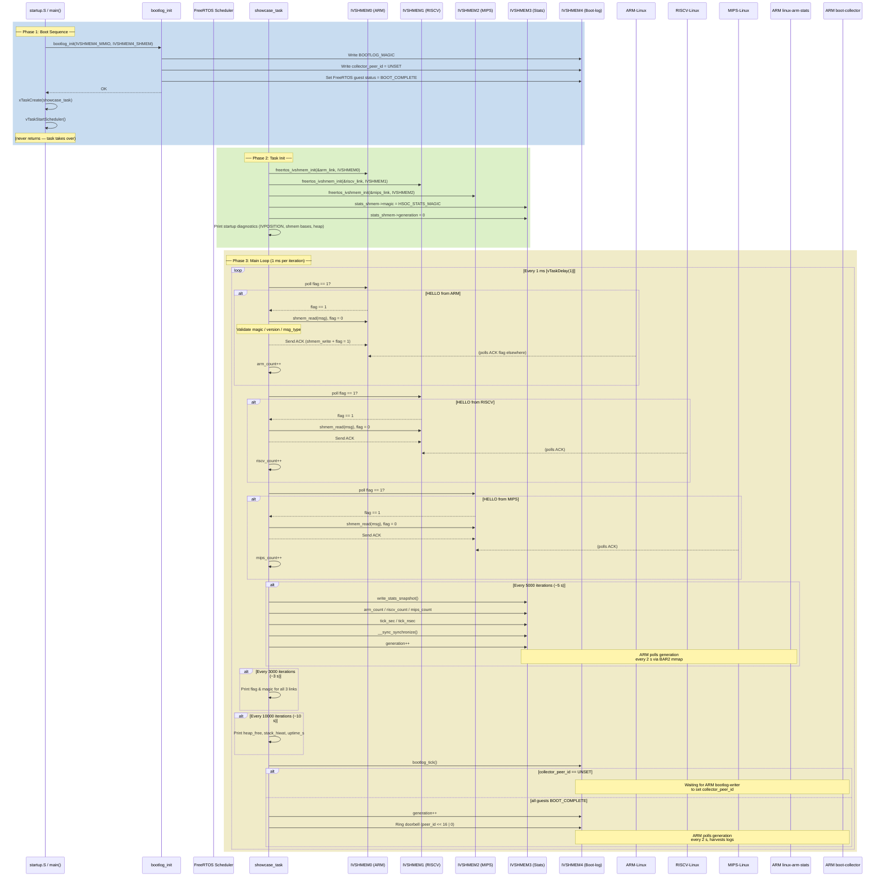

# Heterogeneous SoC FreeRTOS Showcase — Guest Payloads

This directory builds all guest-side payloads for the Chimera heterogeneous SoC
demo, where three Linux guests (ARM, RISC-V, MIPS) send periodic sysinfo
messages to a bare-metal RISC-V FreeRTOS firmware over ivshmem shared memory.

## Directory Layout

### Wire Protocol Headers (shared between FreeRTOS and Linux)

| File | Protocol |
|---|---|
| `hello_proto.h` | HELLO/ACK handshake — `hsoc_channel`, `hsoc_hello_msg`, `hsoc_layout` with flag-gated shared-memory structure |
| `stats_proto.h` | Stats snapshot — `hsoc_stats_snapshot` with generation-counter read protocol (magic → fields → generation increment) |
| `bootlog_proto.h` | Boot-log — `hsoc_bootlog_header`, 4 × 1 MiB guest slots, `BOOTLOG_MAGIC` / `BOOTLOG_SLOT_*` layout constants |

### FreeRTOS Firmware (bare-metal RISC-V, `freertos-riscv-demo.elf`)

| File | Purpose |
|---|---|
| `freertos_main.c` | Entry point (`main`), FreeRTOS `showcase_task` that polls all three HELLO/ACK channels every 1 ms, sends periodic stats snapshots (every 5 s), and runs the boot-log monitor |
| `freertos_ivshmem_flat.c` | `ivshmem-flat` device driver — `freertos_ivshmem_init`, `poll_hello`, `send_ack` with explicit volatile byte loops (no `memcpy`) and `__sync_synchronize()` fences |
| `freertos_ivshmem_flat.h` | `struct freertos_ivshmem_link`, MMIO register offsets (`INTMASK`/`INTSTATUS`/`IVPOSITION`/`DOORBELL`), function declarations |
| `boot_log.c` | Boot-log monitor (`bootlog_init`, `bootlog_tick`, `bootlog_write`) — waits for collector peer ID from ARM, rings doorbell when all guests are booted, writes FreeRTOS UART output into its boot-log slot |
| `boot_log.h` | `struct bootlog_monitor` and function declarations |
| `freertos_libc.c` | Freestanding libc implementations: `memcpy`, `memmove`, `memset`, `memcmp`, `strcpy`, `strlen` |
| `string.h` | libc string header (freestanding) |
| `stdlib.h` | Minimal libc stdlib header (`EXIT_SUCCESS`/`EXIT_FAILURE`) |
| `startup.S` | RISC-V `_start`: set stack pointer, install `mtvec` trap handler, clear BSS, call `main` |
| `linker.ld` | Linker script — RAM at `0x80000000`, 8 MiB, sections with trap handler `KEEP` |
| `FreeRTOSConfig.h` | Kernel config: 10 MHz CPU clock, 1 kHz tick, 64 KiB heap, `configMTIME_BASE_ADDRESS` / `configMTIMECMP_BASE_ADDRESS` for CLINT |

### Linux Guest Binaries (cross-compiled for each arch)

| File | Targets | Purpose |
|---|---|---|
| `linux_syslog.c` | `syslog-arm-linux` / `syslog-riscv-linux` / `syslog-mips-linux` | Reads `/proc/loadavg`, `/proc/meminfo`, `/proc/uptime`, writes a `hsoc_hello_msg` to ivshmem BAR2, waits for FreeRTOS ACK, repeats on configurable interval (default 5 s, `SYSLOG_INTERVAL_SEC` env var) |
| `linux_stats.c` | `linux-arm-stats` (ARM only) | Polls `hsoc_stats_snapshot` generation counter on the stats ivshmem channel, logs each new snapshot to `/var/log/chimera-log/chimera-cross-domain.log` (or `FREERTOS_STATS_LOG` env var) |
| `bootlog_writer.c` | `bootlog-arm-linux` / `bootlog-riscv-linux` / `bootlog-mips-linux` | Opens `/dev/kmsg`, writes kernel log lines into the guest's 1 MiB boot-log slot; ARM variant additionally reads `IVPOSITION` from BAR0 and writes `collector_peer_id` |
| `boot_collector.c` | `boot-collector` (ARM only) | Polls boot-log header generation counter every 2 s, harvests completed guest slots to `/var/log/chimera-log/boot-log/guest-{arm,riscv,mips,freertos}.log` |

### Build & Test

| File | Purpose |
|---|---|
| `Makefile` | Cross-compilation makefile — detects available toolchains, builds all syslog + bootlog + boot-collector + FreeRTOS targets |
| `.gitignore` | Ignores all built ELF binaries |
| `test-syslog-format.sh` | Standalone test that validates `syslog-arm-linux` output format against a temp shared-memory file |

## Building

### Prerequisites

- **ARM/Linux cross-compiler:** `aarch64-linux-gnu-gcc`
- **RISC-V/Linux cross-compiler:** `riscv64-linux-gnu-gcc`
- **MIPS/Linux cross-compiler:** `mipsel-linux-gnu-gcc`
- **RISC-V bare-metal cross-compiler:** `riscv64-unknown-elf-gcc`
- **FreeRTOS kernel source:** Set `FREERTOS_KERNEL_DIR` (default: `$HOME/heterogeneous-soc-freertos/FreeRTOS-Kernel`)

### Build All

```bash
cd /path/to/chimera/contrib/heterogeneous-soc/freertos-showcase
make
```

Linux binaries are automatically skipped when the corresponding cross-compiler
is not installed (a warning is printed).

### Build Individual Targets

```bash
# Linux sysinfo senders (one per architecture)
make syslog-arm-linux syslog-riscv-linux syslog-mips-linux

# ARM-only stats collector
make linux-arm-stats

# Boot-log writers (one per architecture)
make bootlog-arm-linux bootlog-riscv-linux bootlog-mips-linux

# ARM-only boot-log collector
make boot-collector

# FreeRTOS firmware
make freertos-riscv-demo.elf
```

### Clean

```bash
make clean
```

## FreeRTOS `main()` Flow

The following sequence diagram traces execution through `freertos_main.c` — from
the reset vector (`startup.S` calling `main`) through boot-log init, task
creation, scheduler start, and the 1 ms main loop that services all three
HELLO/ACK channels, writes periodic stats snapshots, and monitors the boot-log
generation.



## Wire Protocol (Summary)

See `hello_proto.h` and the main project `README.md` for full details.

The HELLO/ACK channel uses a `struct hsoc_layout` with two flag-gated slots:

```
linux_to_freertos:
  flag = 1  → message ready for FreeRTOS
  flag = 0  → FreeRTOS has consumed it

freertos_to_linux:
  flag = 1  → ACK ready for Linux
  flag = 0  → Linux has consumed it
```

All shared-memory access uses explicit volatile byte loops (`shmem_read` /
`shmem_write`), not `memcpy`, because NEON instructions on ARM SIGBUS on
non-cacheable PCI BAR2 memory. `__sync_synchronize()` (emit `fence iorw,iorw`
on RISC-V, `dmb ish` on AArch64) wraps every flag read/write.

### SYSLOG Protocol (HELLO/ACK)

1. Linux writes `hsoc_hello_msg` (magic, sysinfo text) to `linux_to_freertos.msg`, sets `flag = 1`
2. FreeRTOS polls `flag == 1`, reads the message, validates magic/version/type, clears flag
3. FreeRTOS writes ACK to `freertos_to_linux.msg`, sets `flag = 1`
4. Linux polls `flag == 1`, reads ACK, validates, clears flag
5. Sleep `SYSLOG_INTERVAL_SEC` (default 5 s), repeat

### Stats Protocol (FreeRTOS → ARM only)

1. FreeRTOS writes payload fields directly to `hsoc_stats_snapshot` via volatile stores
2. `__sync_synchronize()` fence
3. `generation++` (volatile store + fence)
4. ARM `linux-arm-stats` polls `generation` every 2 s, reads new snapshots

### Boot-Log Protocol (all guests → ARM collector)

1. FreeRTOS `bootlog_init` writes `BOOTLOG_MAGIC` and `collector_peer_id = UNSET`
2. Each Linux `bootlog-writer` finds the boot-log BAR2, waits for magic, marks its guest `status = BOOT_COMPLETE`, drains `/dev/kmsg` every 2 s
3. FreeRTOS `bootlog_tick` waits for all 4 guests to reach `BOOT_COMPLETE`, then rings doorbell and increments `generation`
4. ARM `boot-collector` polls `generation` every 2 s, harvests 4 guest slots to `/var/log/boot-logs/`

## Testing

```bash
# Validate syslog-arm-linux output format against a temp shmem file
bash test-syslog-format.sh
```

## Notes

- The old `README.rst` is superseded by this file. It referenced a
  `linux_hello.c` and `hello-arm-linux`/`hello-riscv-linux` targets that no
  longer exist — the Linux syslog binary is now `linux_syslog.c` producing
  `syslog-{arch}-linux` targets via `-D` compile flags.
